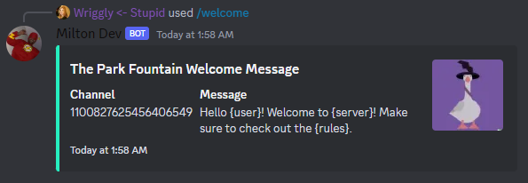
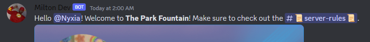

# Administration


<details>

<summary>Enable</summary>

Allows you enable any of the Milton features

* **Logging**: Default -> <mark style="color:green;">True</mark>
* **Leveling**: Default -> <mark style="color:green;">True</mark>
* **Invite Tracking**: Default -> <mark style="color:green;">True</mark>
* **Economy**: Default -> <mark style="color:green;">True</mark>
* **Automod**: Default -> <mark style="color:green;">True</mark>
* **Moderation Commands**: Default -> <mark style="color:green;">True</mark>
* **Fun Commands**: Default -> <mark style="color:green;">True</mark>
* **Music Player**: Default -> <mark style="color:green;">True</mark>

```
Server Only = True
Default Permission = ManageGuild
```

</details>

<details>

<summary>Disable</summary>

Allows you Disable any of the Milton features

* **Logging**: Default -> <mark style="color:green;">True</mark>
* **Leveling**: Default -> <mark style="color:green;">True</mark>
* **Invite Tracking**: Default -> <mark style="color:green;">True</mark>
* **Economy**: Default -> <mark style="color:green;">True</mark>
* **Automod**: Default -> <mark style="color:green;">True</mark>
* **Moderation Commands**: Default -> <mark style="color:green;">True</mark>
* **Fun Commands**: Default -> <mark style="color:green;">True</mark>
* **Music Player**: Default -> <mark style="color:green;">True</mark>

```
Server Only = True
Default Permission = ManageGuild
```

</details>

<details>

<summary>Welcome</summary>

Used to change Welcome Message settings

* **message**: The new welcome message. -> <mark style="color:red;">Required</mark>
* **switch**: Turns welcome messages on/off. (True = On) -> <mark style="color:red;">Required</mark>
* **channel**: Channel to send welcome messages in. -> <mark style="color:red;">Required</mark>

```
Server Only = True
Default Permission = ManageGuild
```

</details>

<details>

<summary>Invite-Create</summary>

Create an Invite to a specific channel

* **invitechannel**: The channel the invite directs to -> <mark style="color:red;">Required</mark>
* **temporaryinvite**: Should members be automatically kicked after 24 hours? -> <mark style="color:green;">Optional</mark>
* **maxage**: Invite duration in hours (0 for forever) -> <mark style="color:green;">Optional</mark>
* **maxuses**: Maximum uses (0 for infinite) -> <mark style="color:green;">Optional</mark>
* **reason**: Reason for creating the invite -> <mark style="color:green;">Optional</mark>

```
Server Only = True
Default Permission = CreateInstantInvite
```

</details>

<details>

<summary>Invite-Delete</summary>

Delete a specified Invite

* **invite**: Invite link or code (https://discord.gg/invite or .gg/_code)_ -> <mark style="color:red;">Required</mark>
* **reason**: Reason for deleting the invite -> <mark style="color:green;">Optional</mark>

```
Server Only = True
Default Permission = ManageGuild
```

</details>

<details>

<summary>Invite-Info</summary>

Information about a specified Invite

* **invite**: Invite link or code (https://discord.gg/invite or .gg/_code)_ -> <mark style="color:red;">Required</mark>

```
Server Only = False
Default Permission = N/A
```

</details>

<details>

<summary>Welcome</summary>

Set up/Change welcome message settings

* **message**: The new welcome message -> <mark style="color:red;">Required</mark>

<!---->

* **channel**: Channel to send welcome messages in -> <mark style="color:red;">Required</mark>


The welcome message has a max length of **250 characters**.&#x20;

* To mention the user that just joined use **{user}**.&#x20;
* To mention the rules channel (if set) use **{rules}**.
* To name the server use **{server}**.

See: [#welcome-examples](administration.md#welcome-examples "mention")

```
Server Only = True
Default Permission = ManageGuild
```

</details>



<figure><figcaption><p>Before</p></figcaption></figure>

<figure><figcaption><p>After</p></figcaption></figure>


